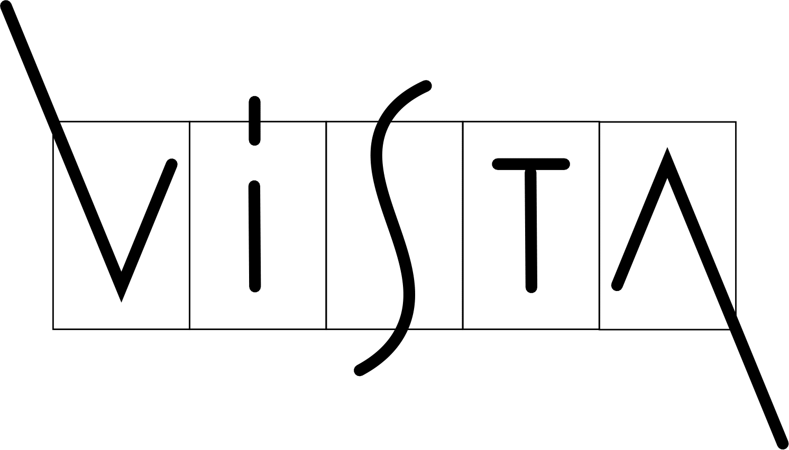
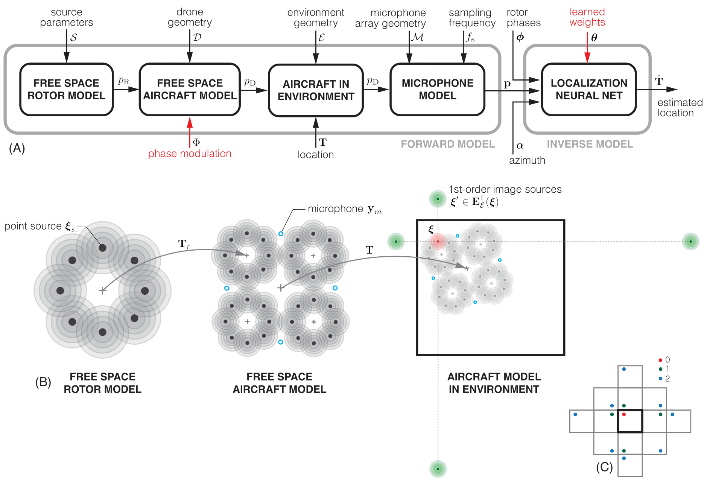

# Active propulsion noise shaping for multi-rotor aircraft localization


## Gabriele Serussi*, Tamir Shor*, Tom Hirshberg, Chaim Baskin, Alex Bronstein  -  
## Technion Institute of Technology 
\* Denotes equal contribution  
>
> Multi-rotor aerial autonomous vehicles (MAVs)
primarily rely on vision for navigation purposes. However,
visual localization and odometry techniques suffer from poor
performance in low or direct sunlight, a limited field of view,
and vulnerability to occlusions. Acoustic sensing can serve as
a complementary or even alternative modality for vision in
many situations, and it also has the added benefits of lower
system cost and energy footprint, which is especially important
for micro aircraft. This paper proposes actively controlling and
shaping the aircraft propulsion noise generated by the rotors to
benefit localization tasks, rather than considering it a harmful
nuisance. We present a neural network architecture for self noise-based localization in a known environment. We show
that training it simultaneously with learning time-varying rotor
phase modulation achieves accurate and robust localization.
The proposed methods are evaluated using a computationally
affordable simulation of MAV rotor noise in 2D acoustic
environments that is fitted to real recordings of rotor pressure
fields.
<br>
<p align="center">
  
</p>
</br>

 

</br>

Pressure Field Simulation:
  
[]([https://www.youtube.com/watch?v=RT3aGX-p-C0](https://youtu.be/pRnapzl87M8))


## Description  
Harness and shape the propulsion noise of multi-rotor aircraft to improve localization accuracy. We propose a system for self-noise-based localization in a known environment. We show that training it simultaneously with learning time-varying rotor phase modulation achieves accurate and robust localization. The proposed methods are evaluated using a computationally affordable simulation of MAV rotor noise in 2D acoustic environments that is fitted to real recordings of rotor pressure fields.

## Setup

### Environment
To set up our environment, please run:

```
pip install -r requirements.txt

or

conda install --file requirements.txt

```


## Usage

### Repo Layout 
Explain repo layout e.g. 
```
outputs/
|-- folder1/
|   |-- smth.py 
|   |-- othersmth.py
|   |-- ...
|   |-- lastsmth.py
|-- folder_2/
|   |-- smth.py 
|   |-- othersmth.py
|   |-- ...
|   |-- lastsmth.py
...
```

### Data
* Link real recordings and explain how to create our simulation per experiment 

### Forward Model

<p align="center">
  
<br>
Forward Process Layout
</p>

#### Forward Model - Parameter fitting

In order to fit the parameters of the forward model run:
```
python forward_model/forward_model.py -gpu <GPU> -exp_name <NAME OF THE EXPERIMENT>
```
Where:
- ```<GPU>``` represents which GPU to use
- ```<NAME OF THE EXPERIMENT>``` represents the name to assign to the experiment

#### Forward Model - Synthesis of the dataset for the inverse model
Once the parameters of the forward model have been fitted, you can synthesize a dataset for the inverse model where the pressure is captured by the microphones mounted on a circular array on the aircraft by running the following command:
```
python forward_model/forward_indoor_wrapper.py -gpu <GPU> -exp_name <NAME OF THE EXPERIMENT> -max_order <MAX ORDER> -num_rotors 4 -num_phases_mics <NUMBER OF MICROPHONES> -saved_data_dir_path <DATA PATH> -e_absorption <WALLS' ABSORPTION COEFFICIENT> -num_points_per_side <NUMBER OF POINTS PER SIDE> -room_x <WALL 1 LENGTH> -room_y <WALL 2 LENGTH> -number_of_angles <NUMBER OF ANGLES PER POINT>
```
Where:
- ```<GPU>``` represents which GPU to use
- ```<NAME OF THE EXPERIMENT>``` is the name assigned to the experiment during the [Parameter fitting](#forward model - parameter fitting) phase
- ```<MAX ORDER>``` is the maximum image order to use 
- ```<NUMBER OF MICROPHONES>``` is the number of microphones to use (e.g. 8)
- ```<DATA PATH>``` is the path to save the data
- ```<WALLS ABSORPTION COEFFICIENT>``` is the absorption coefficient of the walls in the room (e.g. 0.5). The absorption coefficient is a value between 0 and 1, where 0 means no absorption and 1 means full absorption. It is defined as $1 - \gamma$, where $\gamma$ is the reflection coefficient.
- ```<NUMBER OF POINTS PER SIDE>``` is the number of points per side in the room (e.g. 63)
- ```<WALL 1 LENGTH>``` is the length of the first wall in meters (assuming a rectangular room)
- ```<WALL 2 LENGTH>``` is the length of the second wall in meters (assuming a rectangular room)
- ```<NUMBER OF ANGLES PER POINT>``` is the number of angles to use per point in the room (e.g. 64)


### Inverse Model
* Explain how to train inverse model for all experiments


## Acknowledgements 
This research was supported by ERC StG EARS. We are
grateful to Yair Atzmon, Matan Jacoby, Aram Movsisian,
and Alon Gil-Ad for their help with the data acquisition.

## Citation
If you use this code for your research, please cite the following work: 
```
@misc{@article{gabriele2024active,
  title={Active propulsion noise shaping for multi-rotor aircraft localization},
  author={Gabriele, Serussi and Tamir, Shor and Tom, Hirshberg and Chaim, Baskin and Alex, Bronstein},
  journal={arXiv preprint arXiv:2402.17289},
  year={2024}
}
}
```
