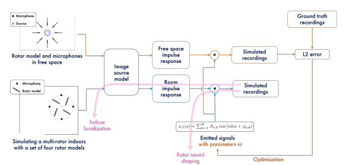

# Active propulsion noise shaping for multi-rotor aircraft localization


> Tamir Shor*, Gabriele Serussi*, Tom Hirshberg, Chaim Baskin, Alex Bronstein  
> Technion Institute of Technology 
> \* Denotes equal contribution  
>
> Multi-rotor aerial autonomous vehicles (MAVs)
primarily rely on vision for navigation purposes. However,
visual localization and odometry techniques suffer from poor
performance in low or direct sunlight, a limited field of view,
and vulnerability to occlusions. Acoustic sensing can serve as
a complementary or even alternative modality for vision in
many situations, and it also has the added benefits of lower
system cost and energy footprint, which is especially important
for micro aircraft. This paper proposes actively controlling and
shaping the aircraft propulsion noise generated by the rotors to
benefit localization tasks, rather than considering it a harmful
nuisance. We present a neural network architecture for selfnoise-based localization in a known environment. We show
that training it simultaneously with learning time-varying rotor
phase modulation achieves accurate and robust localization.
The proposed methods are evaluated using a computationally
affordable simulation of MAV rotor noise in 2D acoustic
environments that is fitted to real recordings of rotor pressure
fields.
<br>

 
<a href="[https://youtu.be/9EWs2IX4cus](https://youtu.be/RT3aGX-p-C0)"></a> 
<br>
<p align="center">
  
</p>

## Description  
Official implementation of our Propulsion Noise-based localization algorithm.

## Setup

### Environment
To set up our environment, please run:

```
pip install -r requirements.txt

or

conda install --file requirements.txt

```


## Usage

### Repo Layout 
Explain repo layout e.g. 
```
outputs/
|-- folder1/
|   |-- smth.py 
|   |-- othersmth.py
|   |-- ...
|   |-- lastsmth.py
|-- folder_2/
|   |-- smth.py 
|   |-- othersmth.py
|   |-- ...
|   |-- lastsmth.py
...
```

### Data
* Link real recordings and explain how to create our simulation per experiment 

### Forward Model

<p align="center">
  
<br>
Forward Process Layout
</p>

* Explain how to train forward model 

### Inverse Model
* Explain how to train inverse model for all experiments


## Acknowledgements 
This research was supported by ERC StG EARS. We are
grateful to Yair Atzmon, Matan Jacoby, Aram Movsisian,
and Alon Gil-Ad for their help with the data acquisition.

## Citation
If you use this code for your research, please cite the following work: 
```
@misc{chefer2023attendandexcite,
      title={Active propulsion noise shaping for multi-rotor aircraft localization}, 
      author={Tamir Shor and Gabriele Serussi and Tom Hirshberg and Chaim Baskin and Alex Bronstein},
      year={2024},
      eprint={?},
      archivePrefix={?},
      primaryClass={?}
}
```
